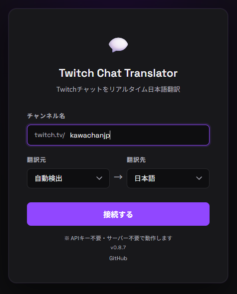
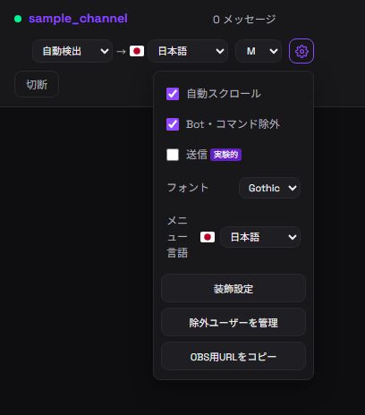
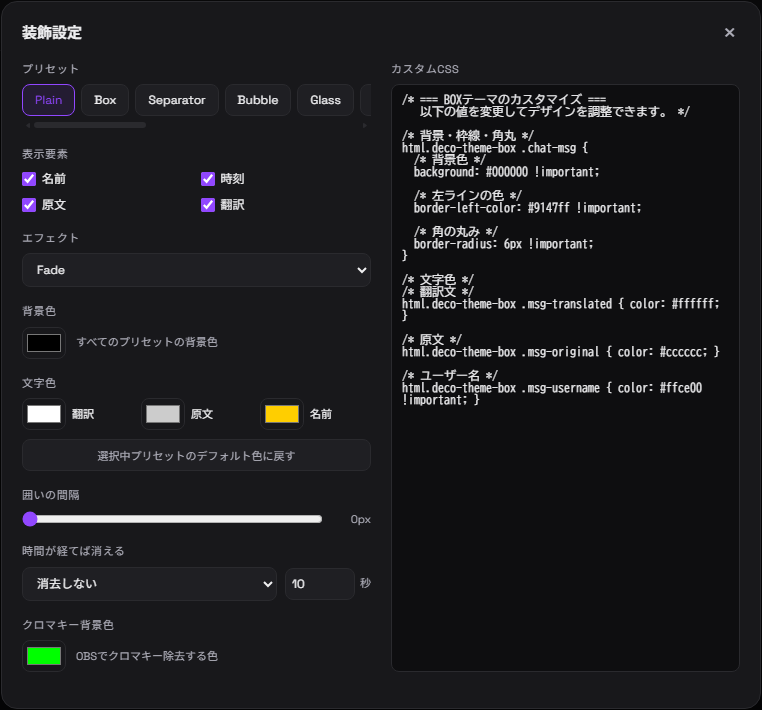
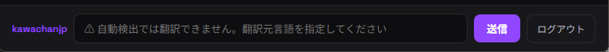

# Twitch Chat Translator

[English](README.en.md) | 日本語 | [Русский](README.ru.md)

Twitchのチャット欄をリアルタイム翻訳して表示するWebアプリです。

**[▶ 今すぐ使う](https://kawachan-jp.github.io/twitch-chat-translate/)**

---

## 特徴

- **APIキー不要** — Google翻訳の非公式APIを使用、登録不要で即使える
- **サーバー不要** — ブラウザだけで完結（GitHub Pagesで動作）
- **匿名接続** — Twitchアカウントなしでチャットを読み取り可能
- **言語自動検出** — 翻訳元言語を自動で識別
- **多言語対応** — 15言語以上に対応
- **スタンプ検出** — エモート連打を自動で折りたたんで表示
- **フォント・サイズ変更** — チャットの見やすさを自由に調整
- **メニュー言語切り替え** — セットアップ画面・チャット画面からUI言語を変更
- **OBSオーバーレイ** — 装飾済みチャットをブラウザソースとして表示
- **豊富な装飾設定** — プリセット・表示要素・色・間隔・表示時間・エフェクトを調整
- **カスタムCSS** — 自由記述CSSでチャット表示を細かくカスタマイズ
- **除外ユーザー管理** — 表示したくないユーザーを設定画面から追加・削除
- **チャット送信（実験的）** — Twitchアカウントでログインして翻訳送信

---

## 使い方

### 1. チャンネルに接続する



1. [ページを開く](https://kawachan-jp.github.io/twitch-chat-translate/)
2. チャンネル名を入力（例: `xqc`）
3. **翻訳元** を選択（わからなければ「自動検出」のままでOK）
4. **翻訳先** を選択（デフォルト: 日本語）
5. **「接続する」** をクリック

### 2. チャット画面の操作



接続後はヘッダーから各種設定を変更できます。

| 項目 | 説明 |
|------|------|
| `自動 → 日本語` | 翻訳元・翻訳先の言語をリアルタイムで切り替え |
| `S / M / L / XL` | チャット文字のサイズを変更 |
| `⚙` | 自動スクロール、Bot除外、送信、フォント、メニュー言語、装飾設定などを開く |
| `切断` | チャンネルから切断してトップに戻る |

### 3. ⚙ 設定パネル

ヘッダーの **⚙アイコン** をクリックすると設定パネルが開きます。

| 設定 | 説明 |
|------|------|
| 自動スクロール | 新しいメッセージが来たとき自動で下にスクロール |
| Bot・コマンド除外 | Botの発言や `!command` 形式のコメントをチャット表示から除外 |
| 送信 [実験的] | Twitchログイン用の送信パネルを表示 |
| フォント | Gothic / Serif / Mono を切り替え |
| メニュー言語 | セットアップ画面とチャット画面のUI言語を変更 |
| 装飾設定 | プリセット、表示要素、色、エフェクト、消える時間、カスタムCSSを変更 |
| 除外ユーザーを管理 | 表示しないユーザーを追加・削除 |
| OBS用URLをコピー | 現在のフォント・装飾設定を含んだOBSブラウザソース用URLをコピー |

---

## 装飾設定

設定パネルの **「装飾設定」** を押すと、チャット表示をプレビューしながら調整できます。



| 項目 | 説明 |
|------|------|
| プリセット | Plain / Box / Separator / Bubble / Speech / Speech2 / Glass / Neon / Compact / Terminal / Minimal / Card / Broadcast / Pastel |
| 表示要素 | 名前・時刻・原文・翻訳の表示/非表示 |
| エフェクト | Fade / Slide / Pop / Rise / Drop / Glow / Flip / Blur / Bounce / Wipe / Flash から新着表示のモーションを選択 |
| 背景色 | すべてのプリセットに共通する発言背景色 |
| 文字色 | 翻訳・原文・名前の色を個別に変更 |
| デフォルト色に戻す | 選択中プリセット本来の配色へ戻す |
| 囲いの間隔 | スライダーで発言同士の余白を調整 |
| 時間が経てば消える | 指定秒数後に Fade / Slide / Shrink / Blur / Wipe / Drop / Flip / Collapse で発言を消去 |
| クロマキー背景色 | OBSで透過に使用する背景色 |
| カスタムCSS | CSSを直接編集して、プリセット以上に表示を細かく調整 |

設定内容はブラウザへ自動保存されます。プリセット、表示要素、色、間隔、消える時間、クロマキー背景色、カスタムCSSは入力時に即時保存・反映されるため、保存ボタンは必要ありません。

### OBSで表示する

1. 装飾設定でチャット表示を調整する
2. 設定パネルから **「OBS用URLをコピー」** を押す
3. OBSでブラウザソースを追加し、コピーしたURLを貼り付ける
4. 必要に応じてOBS側でクロマキーを設定する

装飾設定、表示要素、色、間隔、表示時間、カスタムCSSはコピーしたOBS用URLへ含まれます。

---

## チャット送信機能（実験的）



Twitchアカウントでログインすると、チャットに翻訳して送信できます。

1. ⚙設定パネルで **「送信 [実験的]」** をON
2. **「Twitchでログイン」** をクリックして認証
3. メッセージを入力 → `Enter` または **「送信」** を押す
4. 入力テキストが自動的に**チャットの言語に翻訳**されて送信される

> **注意:** 翻訳元が「自動検出」の場合は翻訳されずそのまま送信されます。翻訳して送信したい場合は翻訳元言語を手動で指定してください。

---

## 自分のサーバーで使う場合

このリポジトリをダウンロードして、自分のサーバーや独自ドメインで公開することもできます。

チャットを**見るだけ・翻訳するだけ**であれば、基本的にはファイル一式をWebサーバーにアップロードするだけで動作します。APIキーやTwitchアカウント連携の設定は不要です。

ただし、**Twitchログインしてチャット送信機能を使う場合**は、Twitch Developer Consoleで自分のアプリを登録する必要があります。

1. [Twitch Developer Console](https://dev.twitch.tv/console) を開く
2. 自分のTwitchアカウントでログインする
3. アプリを登録する
4. `OAuthリダイレクトURL` に公開先のURLを登録する
   - 例: `https://example.com/`
   - ローカルで試す場合: `http://localhost:8000/`
5. 発行された `Client ID` とリダイレクトURLを `js/config.js` に設定する

```js
export const TWITCH_CLIENT_ID = '自分のClient ID';
export const TWITCH_REDIRECT_URI = 'https://example.com/';
```

まとめると、閲覧・翻訳だけならサーバーに置くだけでOKです。チャット送信まで使う場合のみ、Twitch Developer Consoleでの設定が必要になります。

---

## スタンプ（エモート）検出

同じ単語が3回以上連続するメッセージはエモートスパムと判定し、翻訳せずに折りたたんで表示します。

```
🎴 スタンプ  karubisUnun  ×4
```

---

## 対応言語

| 翻訳元 | 翻訳先 |
|--------|--------|
| 自動検出 / 英語 / 韓国語 / 中国語（簡体字・繁体字）<br>スペイン語 / フランス語 / ドイツ語 / ポルトガル語<br>ロシア語 / 日本語 / アラビア語 / ヒンディー語<br>タイ語 / ベトナム語 / インドネシア語 | 英語 / 韓国語 / 中国語（簡体字・繁体字）<br>スペイン語 / フランス語 / ドイツ語 / ポルトガル語<br>ロシア語 / **日本語（デフォルト）** / アラビア語<br>ヒンディー語 / タイ語 / ベトナム語 / インドネシア語 |

---

## 動作環境

- PC・スマホ問わず主要ブラウザで動作
- Google Chrome / Microsoft Edge 推奨

---

## 技術スタック

- Twitch IRC over WebSocket（匿名接続 / OAuth認証）
- Google Translate 非公式API（`sl=auto` で言語自動検出）
- Twitch Helix API（ログインユーザー名取得）
- 純粋なHTML + CSS + JavaScript（フレームワーク不使用）

---

## 注意事項

- Google翻訳の非公式APIは予告なく変更・廃止される可能性があります
- チャットが多いチャンネルでは翻訳が追いつかない場合があります
- 本ツールの使用による損害等について開発者は責任を負いません

---

## 関連

- [speech-to-text](https://github.com/KAWAchan-jp/speech-to-text) — 同作者の音声認識リアルタイム字幕ツール
- [Twitch IRC Documentation](https://dev.twitch.tv/docs/irc/)
